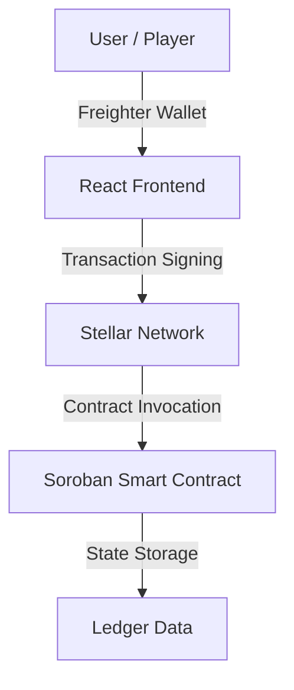

# 🧠 Decentralized Quiz App
[](https://stellar.org)
[](https://soroban.stellar.org)
[](https://opensource.org/licenses/MIT)

A transparent, tamper-proof quiz platform built on the **Stellar Network** using **Soroban** smart contracts. This dApp ensures fairness by storing questions, evaluating answers, and tracking scores entirely on-chain.

---

## 🚀 Key Features

- **On-chain Validation:** Answers are evaluated within the smart contract, preventing any local tampering.
- **Secure Score Tracking:** User scores are stored globally on the Stellar ledger.
- **Permissionless Quiz Creation:** Admins or creators can leverage the `create_quiz` function to expand the question bank.
- **Seamless Wallet Integration:** Fully compatible with **Freighter Wallet** for signing transactions.
- **High Performance:** Leverages Stellar's low-cost and fast finality for a smooth user experience.

---

## 🛠 Tech Stack

### Smart Contract (Backend)
- **Language:** Rust (WebAssembly)
- **Framework:** [Soroban SDK](https://soroban.stellar.org)
- **Deployment:** Stellar Testnet

### Web Application (Frontend)
- **Framework:** React + TypeScript
- **Styling:** CSS (Modular)
- **Interconnectivity:** `@stellar/stellar-sdk` & `@stellar/freighter-api`
- **Build Tool:** Vite

---

## 🏛 Architecture



The application interacts with the **Stellar Testnet**. Read-only operations like fetching questions are handled via RPC simulation, while state-changing operations like `submit_answer` require a signed transaction from the user's wallet.

---

## 📦 Smart Contract API

| Function | Parameters | Return Type | Description |
|:--- |:--- |:--- |:--- |
| `create_quiz` | `creator: Address, question: String, correct_answer: String` | `u32` (ID) | Adds a new quiz question to the global map. |
| `get_question` | `id: u32` | `String` | Fetches the question text for a specific ID. |
| `submit_answer`| `solver: Address, id: u32, answer: String` | `bool` | Validates answer and increments score if correct. |
| `get_score` | `user: Address` | `u32` | Returns the total points earned by a user. |
| `get_total_quizzes` | - | `u32` | Returns the total number of quizzes available. |

---

## 🔗 Deployment Details

- **Contract ID:** `CCATST7MXGZQWB6HQCHDLUKUZA6MVK4KIGCDFVQ34COE543GTINOK3BL`
- **Network:** Stellar Testnet
- **Explorer:** [View on Stellar.Expert](https://stellar.expert/explorer/testnet/contract/CCATST7MXGZQWB6HQCHDLUKUZA6MVK4KIGCDFVQ34COE543GTINOK3BL)
- **Stellar Lab:** [Interact via Laboratory](https://lab.stellar.org/r/testnet/contract/CCATST7MXGZQWB6HQCHDLUKUZA6MVK4KIGCDFVQ34COE543GTINOK3BL)

---

## 🖥️ Getting Started

### Prerequisites

- **Node.js** (v18+)
- **Rust** & **Soroban CLI** (for contract development)
- **Freighter Wallet** installed in your browser

### Installation

1. **Clone the repository:**
   ```bash
   git clone https://github.com/ankush-shaw/DecentralizedQuizApp.git
   cd DecentralizedQuizApp
   ```

2. **Frontend Setup:**
   ```bash
   cd frontend
   npm install
   npm run dev
   ```

3. **Configure Wallet:**
   - Switch Freighter to **Testnet**.
   - Fund your account via the [Stellar Friendbot](https://stellar.org/laboratory/#account-creator).

---

## 📸 Screenshots

<p align="center">
  
  <br>
  <em>Quiz Entry Interface</em>
</p>

<p align="center">
  
  <br>
  <em>Submitting Answers via Freighter</em>
</p>

<p align="center">
  
  <br>
  <em>Real-time Score Updates</em>
</p>

---

## 🔮 Future Roadmap

- [ ] **NFT Rewards:** Mint unique collectibles for top performers.
- [ ] **Global Leaderboard:** Compare scores across all users.
- [ ] **Timed Quizzes:** Introduce time constraints for competitive play.
- [ ] **Dynamic Challenges:** Support for multi-question sets and categories.

---

## 🤝 Contributing

Contributions are welcome! If you'd like to improve the contract logic or frontend UI, please:
1. Fork the repo.
2. Create your feature branch (`git checkout -b feature/AmazingFeature`).
3. Commit your changes (`git commit -m 'Add some AmazingFeature'`).
4. Push to the branch (`git push origin feature/AmazingFeature`).
5. Open a Pull Request.

---

## 📄 License

Distributed under the MIT License. See `LICENSE` for more information.

---

<p align="center">Built with ❤️ on Stellar</p>

