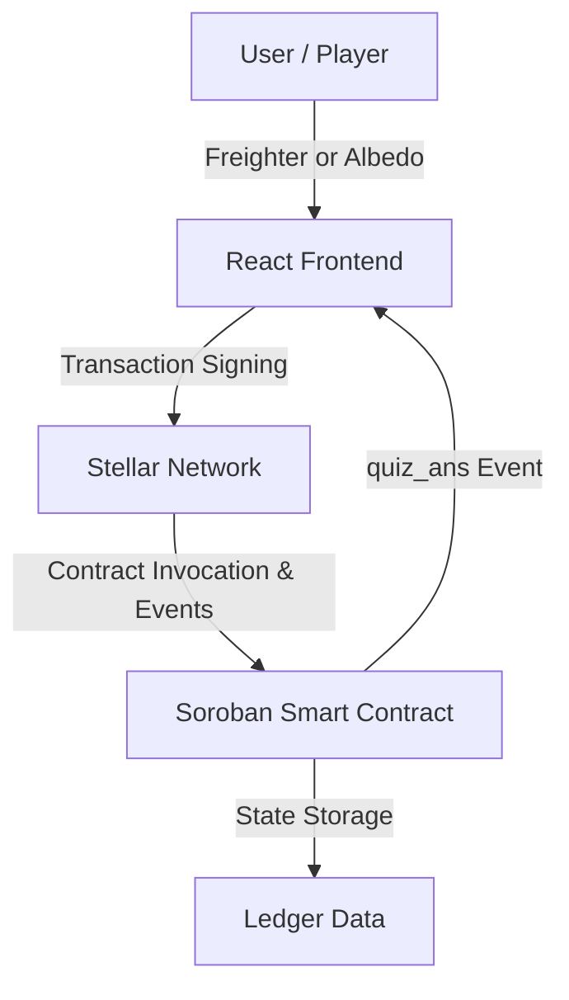

# 🧠 Decentralized Quiz App

[](https://stellar.org)
[](https://soroban.stellar.org)
[](https://opensource.org/licenses/MIT)

A transparent, tamper-proof quiz platform built on the **Stellar Network** using **Soroban** smart contracts. This dApp ensures fairness by storing questions, evaluating answers, and tracking scores entirely on-chain.

---

## 🏆 Project Submission Details

| Item | Value |
|:---|:---|
| **Live Demo** | [https://decentralized-quiz-app.vercel.app/](https://decentralized-quiz-app.vercel.app/) |
| **Demo Video** | [Watch on Google Drive](https://drive.google.com/file/d/1xVaxKEJJ9BJ7o1c8achWptP0uXBA5Jd_/view?usp=sharing) |
| **Contract ID** | `CAHT32ZWBO4DFMNMSXHYMMUGREFNXVSEUTY4DDGOB5M56NJLZKVHKXRK` |
| **Network** | Stellar Testnet |
| **Deployment Tx Hash** | `986afdf18bf053243378f64955d7a501ecfa78b9f04ea8ac828b0093994689d4` |
| **Explorer** | [View on Stellar.Expert](https://stellar.expert/explorer/testnet/contract/CAHT32ZWBO4DFMNMSXHYMMUGREFNXVSEUTY4DDGOB5M56NJLZKVHKXRK) |
| **Token / Pool** | N/A — quiz scoring handled entirely on-chain via contract state |
| **Commits** | 8+ meaningful commits (see git log) |

---

## 📱 Mobile Responsive View

<p align="center">
 

  <br>
  <em>Fully responsive layout on mobile (390px viewport — iPhone 14)</em>
</p>

> The app uses **Tailwind CSS** responsive utilities. All layouts stack vertically on small screens, buttons span full-width, and typography scales correctly across all viewports.

---

## ⚙️ CI/CD Pipeline

The project uses **GitHub Actions** to automatically run on every push and pull request to `main`:

| Job | What it does |
|:---|:---|
| 🦀 **Contract Tests** | `cargo test` — runs all 3 Soroban unit tests |
| 🔨 **WASM Build** | `cargo build --target wasm32-unknown-unknown --release` |
| ⚛️ **Frontend Build** | `npm ci` → `tsc --noEmit` → `npm run build` |
| 🚀 **Deploy Status** | Confirms all jobs passed, logs contract address |

**Workflow file:** [`.github/workflows/ci.yml`](.github/workflows/ci.yml)

---

## 🚀 Key Features

- **On-chain Validation:** Answers are evaluated within the smart contract, preventing any local tampering.
- **Secure Score Tracking:** User scores are stored globally on the Stellar ledger.
- **Multi-Wallet Support:** Fully compatible with both **Freighter** (extension) and **Albedo** (web popup) wallets.
- **Real-Time Event Tracking:** Uses Soroban contract events (`quiz_ans`) to instantly confirm transactions and update the UI.
- **Friendbot Integration:** 1-click funding for new testnet accounts directly from the UI.
- **Mobile Responsive:** Full Tailwind CSS responsive design — works on all screen sizes.
- **High Performance:** Leverages Stellar's low-cost and fast finality for a smooth user experience.

---

## 🛠 Tech Stack

### Smart Contract (Backend)
- **Language:** Rust (WebAssembly / `wasm32-unknown-unknown`)
- **Framework:** [Soroban SDK](https://soroban.stellar.org)
- **Testing:** 3 passing contract unit tests (`cargo test`)
- **Deployment:** Stellar Testnet

### Web Application (Frontend)
- **Framework:** React + TypeScript
- **Styling:** Tailwind CSS + Framer Motion
- **Wallet SDKs:** `@stellar/stellar-sdk`, `@stellar/freighter-api`, `@albedo-link/intent`
- **Build Tool:** Vite

### DevOps
- **CI/CD:** GitHub Actions (3-job pipeline — contract tests + WASM build + frontend build)
- **Hosting:** Vercel (automatic deploys from `main` branch)

---

## 🏛 Architecture



The application interacts with the **Stellar Testnet**. Read-only operations like fetching questions are handled via RPC simulation. State-changing operations like `submit_answer` require a signed transaction, after which the app polls for `quiz_ans` contract events to provide real-time feedback.

---

## 📦 Smart Contract API

| Function | Parameters | Return Type | Description |
|:--- |:--- |:--- |:--- |
| `create_quiz` | `creator: Address, id: u32, question: String, correct_answer: String` | `void` | Adds a new quiz question. Requires auth. |
| `get_question` | `id: u32` | `String` | Fetches the question text for a specific ID. |
| `submit_answer`| `solver: Address, id: u32, answer: String` | `bool` | Validates answer, increments score if correct. Emits `quiz_ans` event. |
| `get_score` | `user: Address` | `u32` | Returns the total points earned by a user. |
| `get_total_quizzes` | — | `u32` | Returns the total number of quizzes available. |

---

## 🔗 Deployment Details

- **Contract ID:** `CAHT32ZWBO4DFMNMSXHYMMUGREFNXVSEUTY4DDGOB5M56NJLZKVHKXRK`
- **Network:** Stellar Testnet
- **Deployment Transaction Hash:** `986afdf18bf053243378f64955d7a501ecfa78b9f04ea8ac828b0093994689d4`
- **Explorer:** [View on Stellar.Expert](https://stellar.expert/explorer/testnet/contract/CAHT32ZWBO4DFMNMSXHYMMUGREFNXVSEUTY4DDGOB5M56NJLZKVHKXRK)
- **Stellar Lab:** [Interact via Laboratory](https://lab.stellar.org/r/testnet/contract/CAHT32ZWBO4DFMNMSXHYMMUGREFNXVSEUTY4DDGOB5M56NJLZKVHKXRK)

---

## ✅ Smart Contract Tests

All 3 tests pass with `cargo test`:

```
test test::test_create_quiz             ... ok
test test::test_submit_correct_answer   ... ok
test test::test_submit_incorrect_answer ... ok

test result: ok. 3 passed; 0 failed; 0 ignored
```


---

## 🖥️ Getting Started

### Prerequisites

- **Node.js** (v18+)
- **Rust** & **Soroban CLI** (for contract development)
- **Freighter Wallet** browser extension

### Installation

1. **Clone the repository:**
   ```bash
   git clone https://github.com/ankush-shaw/DecentralizedQuizApp-2.0.git
   cd DecentralizedQuizApp-2.0
   ```

2. **Frontend Setup:**
   ```bash
   cd frontend
   npm install
   npm run dev
   ```

3. **Configure Wallet:**
   - Switch Freighter to **Testnet**.
   - Fund your account via the [Stellar Friendbot](https://stellar.org/laboratory/#account-creator).

---

## 📸 Screenshots

<p align="center">
  
  <br>
  <em>Quiz Entry Interface</em>
</p>

<p align="center">
  
  <br>
  <em>Submitting Answers via Freighter</em>
</p>

<p align="center">
  
  <br>
  <em>Real-time Score Updates</em>
</p>

---

## 🔮 Future Roadmap

- [ ] **NFT Rewards:** Mint unique collectibles for top performers.
- [ ] **Global Leaderboard:** Compare scores across all users.
- [ ] **Timed Quizzes:** Introduce time constraints for competitive play.
- [ ] **Dynamic Challenges:** Support for multi-question sets and categories.

---

## 🤝 Contributing

Contributions are welcome! If you'd like to improve the contract logic or frontend UI, please:
1. Fork the repo.
2. Create your feature branch (`git checkout -b feature/AmazingFeature`).
3. Commit your changes (`git commit -m 'Add some AmazingFeature'`).
4. Push to the branch (`git push origin feature/AmazingFeature`).
5. Open a Pull Request.

---

## 📄 License

Distributed under the MIT License. See `LICENSE` for more information.

---

<p align="center">Built with ❤️ on Stellar</p>
