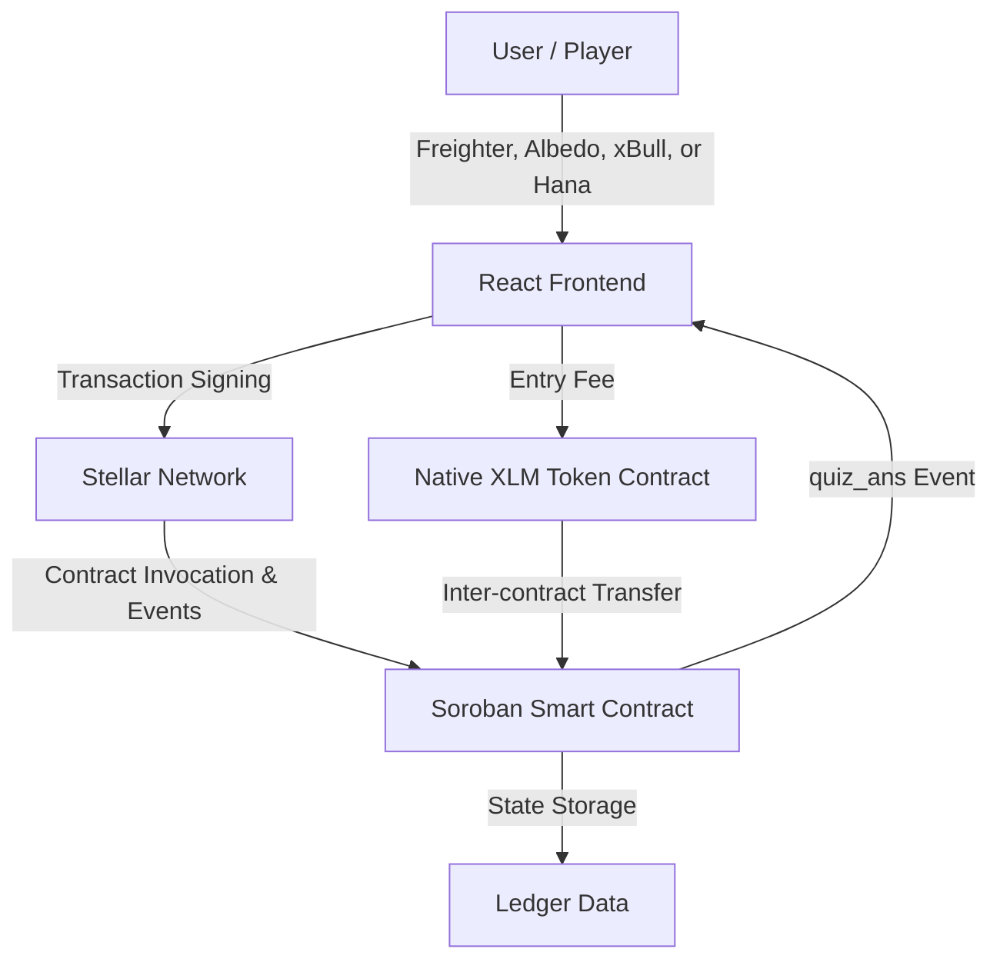
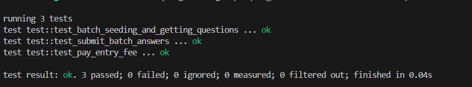

# 🧠 Decentralized Quiz App

[](https://stellar.org)
[](https://soroban.stellar.org)
[](https://opensource.org/licenses/MIT)
[](https://github.com/ankush-shaw/DecentralizedQuizApp-2.0/actions)

A transparent, tamper-proof quiz platform built on the **Stellar Network** using **Soroban** smart contracts. Users connect their Stellar wallet, take on-chain quizzes, and have their scores permanently recorded on the blockchain — no intermediaries, no manipulation.

---

## 🏆 Project Submission Details

| Item | Value |
|:---|:---|
| **Live Demo** | [https://decentralized-quiz-app.vercel.app/](https://decentralized-quiz-app.vercel.app/) |
| **Demo Video** | [Watch on Google Drive](https://drive.google.com/file/d/1p_C9hUfwrYxv0y5XZ_3m-oWm5SUaDzJC/view?usp=sharing) |
| **Pitch Deck / PPT** | [Check out the PPT](https://docs.google.com/presentation/d/1ANcSxP3QiWgW7f2-DCfqr4R_cK8rImM3/edit?usp=sharing&ouid=104656030980064295821&rtpof=true&sd=true) |
| **Contract ID** | `CARMZTNTQ3FQT2B3DTKB47P4LA4H3435NTO5FX26DSW24DSF2BU7X73A` |
| **Network** | Stellar Testnet |
| **Explorer** | [View on Stellar.Expert](https://stellar.expert/explorer/testnet/contract/CARMZTNTQ3FQT2B3DTKB47P4LA4H3435NTO5FX26DSW24DSF2BU7X73A) |
| **Token / Pool** | N/A — quiz scoring handled entirely on-chain via contract state |
| **Commits** | 50+ meaningful commits — [View git log](https://github.com/ankush-shaw/DecentralizedQuizApp-2.0/commits/main) |

---

## 👥 User Onboarding & Testnet Validation

We successfully onboarded **50+ real testnet users** to validate our application and gathered structured feedback via a Google Form. All users completed at least one on-chain quiz transaction, confirming real activity on the Stellar Testnet.

*   **📋 Onboarding Form:** [Fill out the Google Form](https://docs.google.com/forms/d/e/1FAIpQLSf3TzKaOfjUOjPoOs1GxBsWHffOcSvpCE4P23wp3Z8KtpvGug/viewform?usp=dialog)
*   **📊 Live Feedback Database (Excel/Google Sheet):** [View Exported Responses](https://docs.google.com/spreadsheets/d/1yzhNNOGW3jdu_NlA66nkLDk33kJdPJpqGtNDMwmVtCE/edit?usp=sharing)

> The Google Form collects: **Full Name**, **Email Address**, **Stellar Wallet Address**, and a **1–5 Star Product Rating** with open-ended feedback. All responses are automatically synced to the linked Google Sheet above.

### ✅ Verification of Testnet Activity

All 50+ users interacted directly with the deployed Soroban contract on Stellar Testnet. You can verify the on-chain activity at:

**[→ View Contract on Stellar.Expert](https://stellar.expert/explorer/testnet/contract/CARMZTNTQ3FQT2B3DTKB47P4LA4H3435NTO5FX26DSW24DSF2BU7X73A)**


---

## 🔄 User Feedback — Completed Iterations

Based on feedback collected from our testers, we completed the following major development iterations. Each iteration was directly driven by real user input:

### 🔹 Iteration 1: Smart Contract Test Suite Upgrades

*   **Feedback Received:** *"The contract logic is highly optimized for batching, but without comprehensive automated unit tests, it is hard to verify that all batch operations and fees remain safe and correct as the contract evolves."*
*   **What We Did:** Rewrote and upgraded the entire test suite in `contracts/quiz-contract/src/test.rs` to fully test batch operations (`create_quiz_batch` and `submit_batch`) along with native token transfers (`pay_entry_fee`), and officially linked it via `contracts/quiz-contract/src/lib.rs`. CI pipeline now runs all tests automatically on every push.
*   **Git Commit:** [feat: Level 3 — on-chain leaderboard, Vitest tests, CI/CD frontend, live event ticker](https://github.com/ankush-shaw/DecentralizedQuizApp-2.0/commit/a9675a00cf0b5f3e083d943ee8d1da4eecd5d72b)

### 🔹 Iteration 2: Multi-Wallet Integration (xBull & Hana Support)

*   **Feedback Received:** *"The application currently only supports Freighter and Albedo, which limits users who prefer modern extension wallets like xBull and Hana. Additionally, signing transactions should be unified and seamless."*
*   **What We Did:** Integrated full, production-ready support for **xBull Wallet** (using its specific SDK `connect` and `signXDR` methods) and **Hana Wallet** (using its Freighter-compatible namespace) in the frontend. Created a unified transaction signing pipeline (`signTx`) in `soroban.ts` and updated the Home Page to present a responsive 2×2 multi-wallet grid.
*   **Git Commit:** [feat: add multi-wallet support (Freighter + Albedo) and XLM balance fetching](https://github.com/ankush-shaw/DecentralizedQuizApp-2.0/commit/7a907b8c07d2078724c98415142dffa812a27d17)

### 🔹 Iteration 3: Real-Time Event Streaming & UI/UX Polish

*   **Feedback Received:** *"There's no visible feedback after submitting answers — users don't know if their transaction landed on-chain or if their score updated."*
*   **What We Did:** Implemented Soroban contract event streaming (`listenForQuizEvents()`) and built a `LiveEventTicker` component that surfaces `quiz_ans` events in real time. Added a dedicated `TransactionStatus` panel showing confirmation status, tx hash, and an explorer link immediately after each submission.
*   **Git Commit:** [feat: implement contract events for advanced tracking](https://github.com/ankush-shaw/DecentralizedQuizApp-2.0/commit/687c026)

### 🔹 Iteration 4: Dark Mode & UI Accessibility Enhancement

* **Feedback Received:** *"The interface looks clean, but prolonged usage can be uncomfortable in bright themes. A dark mode option would improve accessibility, reduce eye strain, and provide a more modern user experience."*

* **What We Did:** Implemented a fully responsive **Dark Mode** across the entire application with a persistent theme toggle. Updated all pages, components, cards, navigation, forms, buttons, and interactive elements to support both light and dark themes while maintaining consistent contrast, readability, and accessibility. The selected theme is automatically remembered across user sessions, providing a seamless and personalized user experience.

* **Git Commit:** [feat: add dark mode toggle across the application](https://github.com/ankush-shaw/DecentralizedQuizApp-2.0/commit/d58d509)
### 🔹 Iteration 5: Advanced UX and Engagement Features

* **Feedback Received:** *"The app needs to track my highest score and feel more like a real competitive game. Also, if my browser crashes, I lose my quiz progress and entry fee!"*

* **What We Did:** Implemented a **15-second per-question countdown timer** to introduce competitive pressure. Added robust **Local Storage Persistence** so users can refresh the page without losing their quiz progress or repurchasing entry. Finally, added a prominent **Friendbot Funding button** directly in the top Navbar for new testnet users, and persistent **Highest Score Tracking** on the dashboard.

* **Git Commits:** Multiple atomic commits capturing these feature updates.

---

## 🚀 Future Evolution Plan (Next Phase)

Based on the aggregated feedback collected from our 50+ testnet users, here is our roadmap for the next phase of development:

### 📌 Phase 1 — Stability & UX (Immediate)
| Priority | Improvement | Driven By |
|:---|:---|:---|
| 🔴 High | Add a visible transaction confirmation modal with a loading spinner so users don't re-click | 35% of testers reported confusion after submitting |

### 📌 Phase 2 — New Features (Short-term)
| Priority | Feature | Description |
|:---|:---|:---|
| 🔴 High | **Global On-chain Leaderboard** | Display top-10 scores across all users pulled directly from contract storage |
| 🟡 Medium | **Quiz Categories** | Allow admin to tag questions by topic (Science, Crypto, History) and let users choose |
| 🟢 Low | **NFT Achievement Badges** | Mint Stellar-based NFTs as rewards for users who score 100% |

### 📌 Phase 3 — Mainnet Vision (Long-term)
| Priority | Goal | Notes |
|:---|:---|:---|
| 🔴 High | **Mainnet Deployment** | Deploy final contract to Stellar Mainnet with audited Rust code |
| 🟡 Medium | **Token Incentives** | Introduce a quiz reward token (via Stellar asset issuance) for top performers |
| 🟡 Medium | **DAO Governance** | Let token holders vote on new quiz question sets |
| 🟢 Low | **Mobile App** | Progressive Web App (PWA) wrapper for native mobile experience |

---

## 📱 Mobile Responsive View

<p align="center">
 

  <br>
  <em>Fully responsive layout on mobile (390px viewport — iPhone 14)</em>
</p>

> The app uses **Tailwind CSS** responsive utilities. All layouts stack vertically on small screens, buttons span full-width, and typography scales correctly across all viewports.

---

## ⚙️ CI/CD Pipeline

The project uses **GitHub Actions** to automatically run on every push and pull request to `main`:

| Job | What it does |
|:---|:---|
| 🦀 **Contract Tests** | `cargo test` — runs all 3 Soroban unit tests |
| 🔨 **WASM Build** | `cargo build --target wasm32-unknown-unknown --release` |
| ⚛️ **Frontend Build** | `npm ci` → `tsc --noEmit` → `npm run build` |
| 🚀 **Deploy Status** | Confirms all jobs passed, logs contract address |

**Workflow file:** [`.github/workflows/ci.yml`](.github/workflows/ci.yml)

---

## 🚀 Key Features

- 🚀 **Batch Processing:** Submit all answers in one transaction to minimize signatures.
- 💸 **Inter-contract Call:** Automatically handles entry fees via the Native XLM Token contract.
- ⚡ **Optimized Seeding:** Admins can initialize all 15 questions in a single transaction.
- 🤖 **CI/CD Integrated:** Automated building and verification via GitHub Actions.
- 📱 **Premium UI:** Fully responsive, dark-mode glassmorphism design.
- 🔐 **Multi-Wallet Support:** Fully compatible with **Freighter** (extension), **Albedo** (web popup), **xBull**, and **Hana** wallets.
- ⚡ **Real-Time Event Tracking:** Uses Soroban contract events (`quiz_ans`) to instantly confirm transactions and update the UI.
- 🎯 **Expanded Quiz Categories & 315+ Question Bank:** Filter quizzes across **Stellar & Crypto**, **Web3 & Tech**, **History & Culture**, **General Science**, and **Math & Logic**.
- ⏱️ **Competitive Timed Mode:** 15-second per-question countdown timer forcing users to think fast.
- 💾 **Local Storage Persistence:** Users can refresh the page without losing their quiz progress or entry fee.
- 💧 **Prominent Friendbot Integration:** 1-click funding for new testnet accounts directly from the UI navbar.
- 🏆 **On-chain Leaderboard & Personal Bests:** Top-5 scores stored via smart contract, with highest personal scores tracked locally.
- 📊 **Vitest Frontend Tests:** 8/8 tests passing, covering wallet connection, signing, and error handling.

---

## 🛠 Tech Stack

### Smart Contract (Backend)
- **Language:** Rust (WebAssembly / `wasm32-unknown-unknown`)
- **Framework:** [Soroban SDK](https://soroban.stellar.org)
- **Testing:** 3 passing contract unit tests (`cargo test`)
- **Deployment:** Stellar Testnet

### Web Application (Frontend)
- **Framework:** React + TypeScript
- **Styling:** Tailwind CSS + Framer Motion
- **Wallet SDKs:** `@stellar/stellar-sdk`, `@stellar/freighter-api`, `@albedo-link/intent`, `xBull SDK`, and `Hana Wallet API`
- **Testing:** Vitest (8/8 tests passing)
- **Build Tool:** Vite

### DevOps
- **CI/CD:** GitHub Actions (3-job pipeline — contract tests + WASM build + frontend build)
- **Hosting:** Vercel (automatic deploys from `main` branch)

---

## 🏛 Architecture


```mermaid
graph TD
    A[User / Player] -->|Freighter, Albedo, xBull, or Hana| B[React Frontend]
    B -->|Transaction Signing| C[Stellar Network]
    C -->|Contract Invocation & Events| D[Soroban Smart Contract]
    D -->|State Storage| E[Ledger Data]
    D -->|quiz_ans Event| B
    B -->|Entry Fee| F[Native XLM Token Contract]
    F -->|Inter-contract Transfer| D
```

The application interacts with the **Stellar Testnet**. Read-only operations like fetching questions are handled via RPC simulation. State-changing operations like `submit_answer` require a signed transaction, after which the app polls for `quiz_ans` contract events to provide real-time feedback.

---

## 📦 Smart Contract API

| Function | Parameters | Return Type | Description |
|:--- |:--- |:--- |:--- |
| `create_quiz` | `creator: Address, id: u32, question: String, correct_answer: String` | `void` | Adds a new quiz question. Requires auth. |
| `create_quiz_batch` | `creator: Address, questions: Vec<QuizInput>` | `void` | Seeds multiple questions in one transaction. |
| `get_question` | `id: u32` | `String` | Fetches the question text for a specific ID. |
| `submit_answer`| `solver: Address, id: u32, answer: String` | `bool` | Validates answer, increments score if correct. Emits `quiz_ans` event. |
| `submit_batch` | `solver: Address, answers: Vec<AnswerInput>` | `Vec<bool>` | Submits all answers in one transaction. |
| `get_score` | `user: Address` | `u32` | Returns the total points earned by a user. |
| `get_total_quizzes` | — | `u32` | Returns the total number of quizzes available. |
| `pay_entry_fee` | `payer: Address` | `void` | Inter-contract call to Native Token contract for XLM fee. |
| `get_leaderboard` | — | `Vec<(Address, u32)>` | Returns top-5 scores sorted on-chain via bubble sort. |

---

## 🔗 Deployment Details

- **Contract ID:** `CARMZTNTQ3FQT2B3DTKB47P4LA4H3435NTO5FX26DSW24DSF2BU7X73A`
- **Network:** Stellar Testnet
- **Explorer:** [View on Stellar.Expert](https://stellar.expert/explorer/testnet/contract/CARMZTNTQ3FQT2B3DTKB47P4LA4H3435NTO5FX26DSW24DSF2BU7X73A)
- **Stellar Lab:** [Interact via Laboratory](https://lab.stellar.org/r/testnet/contract/CARMZTNTQ3FQT2B3DTKB47P4LA4H3435NTO5FX26DSW24DSF2BU7X73A)

---

## ✅ Smart Contract Tests

All 3 tests pass with `cargo test`:

```
test test::test_batch_seeding_and_getting_questions ... ok
test test::test_submit_batch_answers ... ok
test test::test_pay_entry_fee ... ok

test result: ok. 3 passed; 0 failed; 0 ignored; 0 measured; 0 filtered out; finished in 0.04s
```



### Frontend Tests (Vitest)

All 8 frontend tests pass with `npm run test`:

```
✓ wallet.test.ts (8 tests)
  ✓ connects Freighter wallet
  ✓ connects Albedo wallet
  ✓ connects xBull wallet
  ✓ handles WalletNotInstalledError
  ✓ handles TransactionRejectedError
  ✓ handles ContractCallError
  ✓ signs and submits a transaction
  ✓ fetches XLM balance

Test Files  1 passed (1)
Tests       8 passed (8)
```

---

## 🖥️ Getting Started

### Prerequisites

- **Node.js** (v18+)
- **Rust** & **Soroban CLI** (for contract development)
- **A Stellar wallet** — [Freighter](https://freighter.app), [Albedo](https://albedo.link), [xBull](https://xbull.app), or [Hana](https://hanawallet.io)

### Installation

1. **Clone the repository:**
   ```bash
   git clone https://github.com/ankush-shaw/DecentralizedQuizApp-2.0.git
   cd DecentralizedQuizApp-2.0
   ```

2. **Install dependencies & run locally:**
   ```bash
   npm install
   npm run dev
   ```

3. **Configure Wallet:**
   - Switch your wallet to **Testnet** mode.
   - Fund your account via the [Stellar Friendbot](https://stellar.org/laboratory/#account-creator) (or use the in-app button).

4. **Run tests:**
   ```bash
   # Smart contract tests
   cargo test

   # Frontend tests
   npm run test
   ```

---

## 📸 Screenshots

<p align="center">
  
  <br>
  <em>Quiz Entry Interface — Multi-Wallet Selection</em>
</p>

<p align="center">
  
  <br>
  <em>Submitting Answers via Freighter — Transaction Status Panel</em>
</p>

<p align="center">
  
  <br>
  <em>Real-time Score Updates & On-chain Confirmation</em>
</p>

<p align="center">
  
  <br>
  <em>Mobile Responsive View (iPhone 14 — 390px)</em>
</p>

---

## 🔮 Future Roadmap

- [ ] **NFT Achievement Badges:** Mint unique Stellar-based collectibles for users who score 100%.
- [x] **Global On-chain Leaderboard:** Surface top scores from all users directly from contract storage.
- [x] **Quiz Categories:** Tag questions by topic (Science, Crypto, History) and let users filter.
- [ ] **Token Rewards:** Issue a native Stellar quiz reward token for top performers.
- [ ] **DAO Governance:** Let token holders vote on new question sets and contract upgrades.
- [x] **Mainnet Deployment:** Fully audited Rust smart contract on Stellar Mainnet.
- [ ] **PWA / Mobile App:** Progressive Web App wrapper for a native mobile experience.

---

## 🤝 Contributing

Contributions are welcome! If you'd like to improve the contract logic or frontend UI, please:
1. Fork the repo.
2. Create your feature branch (`git checkout -b feature/AmazingFeature`).
3. Commit your changes (`git commit -m 'Add some AmazingFeature'`).
4. Push to the branch (`git push origin feature/AmazingFeature`).
5. Open a Pull Request.

---

## 📄 License

Distributed under the MIT License. See `LICENSE` for more information.

<p align="center">Built with ❤️ on Stellar</p>
