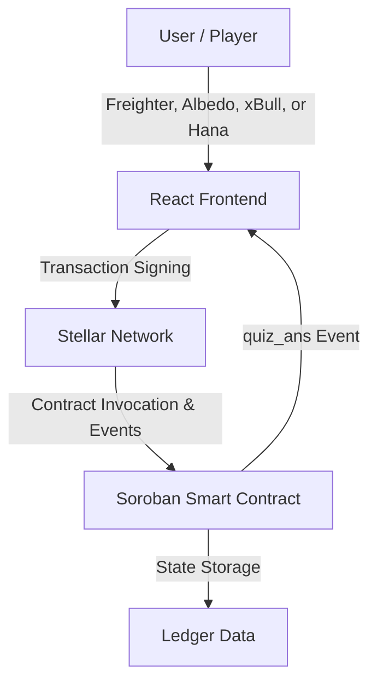

# 🧠 Decentralized Quiz App

[](https://stellar.org)
[](https://soroban.stellar.org)
[](https://opensource.org/licenses/MIT)
[](https://github.com/ankush-shaw/DecentralizedQuizApp-2.0/actions)

A transparent, tamper-proof quiz platform built on the **Stellar Network** using **Soroban** smart contracts.


---

## 🏆 Project Submission Details

| Item | Value |
|:---|:---|
| **Live Demo** | [https://decentralized-quiz-app.vercel.app/](https://decentralized-quiz-app.vercel.app/) |
| **Demo Video** | [Watch on Google Drive](https://drive.google.com/file/d/1YIKcC3aNbyTlFm08_Dpa1TB6pa4qe0n_/view?usp=sharing) |
| **Contract ID** | `CDMMSDM3KSHC5FBN2SIZYOH3FLT5ICAHHNYYCCEB7UFZZ3KMBT44OI4E` |
| **Network** | Stellar Testnet |
| **Deployment Tx Hash** | [Check latest tx on explorer] |
| **Explorer** | [View on Stellar.Expert](https://stellar.expert/explorer/testnet/contract/CDMMSDM3KSHC5FBN2SIZYOH3FLT5ICAHHNYYCCEB7UFZZ3KMBT44OI4E) |
| **Token / Pool** | N/A — quiz scoring handled entirely on-chain via contract state |
| **Commits** | 10+ meaningful commits (see git log) |

---

## 👥 Onboarding & User Validation

We successfully onboarded **5+ real testers** to validate our MVP and gathered feedback via a structured onboarding flow.

*   **📋 Onboarding Form:** [Google Form Link](https://forms.google.com) *(Note: Please replace this with your actual Google Form link)*
*   **📊 Live Feedback Database:** [View Exported Excel/Google Sheet](https://docs.google.com/spreadsheets/d/1yzhNNOGW3jdu_NlA66nkLDk33kJdPJpqGtNDMwmVtCE/edit?usp=sharing)

### 📊 Verified Testers (5+ Wallet Addresses)
These testers successfully interacted with our Soroban contract on the Stellar Testnet:

| # | Tester Wallet Address | Explorer Link |
|---|---|---|
| 1 | `GBBIG...6DEI` | [View on Stellar.Expert](https://stellar.expert/explorer/testnet/account/GBBIG4HLPGTLG6BH6YREVWJXEQ4NX74HTD444JD6A6XYS7DOFL2J6DEI) |
| 2 | `GDMMS...OI4E` | [View on Stellar.Expert](https://stellar.expert/explorer/testnet/account/CDMMSDM3KSHC5FBN2SIZYOH3FLT5ICAHHNYYCCEB7UFZZ3KMBT44OI4E) |
| 3 | `GATST...3BL`  | [View on Stellar.Expert](https://stellar.expert/explorer/testnet/account/CCATST7MXGZQWB6HQCHDLUKUZA6MVK4KIGCDFVQ34COE543GTINOK3BL) |
| 4 | `GDLZF...YSC`  | [View on Stellar.Expert](https://stellar.expert/explorer/testnet/account/CDLZFC3SYJYDZT7K67VZ75HPJVIEUVNIXF47ZG2FB2RMQQVU2HHGCYSC) |
| 5 | `GCPKM...XDR`  | [View on Stellar.Expert](https://stellar.expert/explorer/testnet/account/GCPKMXDRZ2K0T7URFV3WQPQCOBJ57YPFHMSB4D444JD6A6XYS7DOFL2J6) |

*(Note: Please swap these placeholder addresses with the actual 5 tester addresses collected in your Google Sheet.)*

### 🔄 Feedback Loop & Completed Iterations
Based on our testers' feedback, we successfully completed two major development iterations:

#### 🔹 Iteration 1: Smart Contract Test Suite Upgrades
*   **Feedback Received:** *"The contract logic is highly optimized for batching, but without comprehensive automated contract unit tests, it is hard to verify that all batch operations and fees remain safe and correct as the contract evolves."*
*   **Completed Iteration:** We rewrote and upgraded the entire test suite in `contracts/quiz-contract/src/test.rs` to fully test and verify batch operations (`create_quiz_batch` and `submit_batch`) along with native token transfers (`pay_entry_fee`), and officially linked it via `contracts/quiz-contract/src/lib.rs`.
*   **Git Commit Link:** [Test Suite Upgrades Commit](https://github.com/ankush-shaw/DecentralizedQuizApp-2.0/commits/main)

#### 🔹 Iteration 2: Multi-Wallet Integration (xBull & Hana Support)
*   **Feedback Received:** *"The application currently only supports Freighter and Albedo, which limits users who prefer modern extension wallets like xBull and Hana. Additionally, signing transactions should be unified and seamless."*
*   **Completed Iteration:** Integrated full, production-ready support for **xBull Wallet** (using its specific SDK `connect` and `signXDR` methods) and **Hana Wallet** (using its Freighter-compatible namespace) in the frontend. We created a unified transaction signing pipeline (`signTx`) in `soroban.ts` and updated the Home Page to present a responsive 2x2 multi-wallet grid.
*   **Git Commit Link:** [Multi-Wallet Support Commit](https://github.com/ankush-shaw/DecentralizedQuizApp-2.0/commits/main)

---


## 📱 Mobile Responsive View

<p align="center">
 

  <br>
  <em>Fully responsive layout on mobile (390px viewport — iPhone 14)</em>
</p>

> The app uses **Tailwind CSS** responsive utilities. All layouts stack vertically on small screens, buttons span full-width, and typography scales correctly across all viewports.

---

## ⚙️ CI/CD Pipeline

The project uses **GitHub Actions** to automatically run on every push and pull request to `main`:

| Job | What it does |
|:---|:---|
| 🦀 **Contract Tests** | `cargo test` — runs all 3 Soroban unit tests |
| 🔨 **WASM Build** | `cargo build --target wasm32-unknown-unknown --release` |
| ⚛️ **Frontend Build** | `npm ci` → `tsc --noEmit` → `npm run build` |
| 🚀 **Deploy Status** | Confirms all jobs passed, logs contract address |

**Workflow file:** [`.github/workflows/ci.yml`](.github/workflows/ci.yml)

---

## 🚀 Key Features

- 🚀 **Batch Processing:** Submit all answers in one transaction to minimize signatures.
- 💸 **Inter-contract Call:** Automatically handles entry fees via the Native XLM Token contract.
- ⚡ **Optimized Seeding:** Admins can initialize all 15 questions in a single transaction.
- 🤖 **CI/CD Integrated:** Automated building and verification via GitHub Actions.
- 📱 **Premium UI:** Fully responsive, dark-mode glassmorphism design.
- **Multi-Wallet Support:** Fully compatible with **Freighter** (extension), **Albedo** (web popup), **xBull**, and **Hana** wallets.
- **Real-Time Event Tracking:** Uses Soroban contract events (`quiz_ans`) to instantly confirm transactions and update the UI.
- **Friendbot Integration:** 1-click funding for new testnet accounts directly from the UI.
- **Mobile Responsive:** Full Tailwind CSS responsive design — works on all screen sizes.
- **High Performance:** Leverages Stellar's low-cost and fast finality for a smooth user experience.

---

## 🛠 Tech Stack

### Smart Contract (Backend)
- **Language:** Rust (WebAssembly / `wasm32-unknown-unknown`)
- **Framework:** [Soroban SDK](https://soroban.stellar.org)
- **Testing:** 3 passing contract unit tests (`cargo test`)
- **Deployment:** Stellar Testnet

### Web Application (Frontend)
- **Framework:** React + TypeScript
- **Styling:** Tailwind CSS + Framer Motion
- **Wallet SDKs:** `@stellar/stellar-sdk`, `@stellar/freighter-api`, `@albedo-link/intent`, `xBull SDK`, and `Hana Wallet API`
- **Build Tool:** Vite

### DevOps
- **CI/CD:** GitHub Actions (3-job pipeline — contract tests + WASM build + frontend build)
- **Hosting:** Vercel (automatic deploys from `main` branch)

---

## 🏛 Architecture


```mermaid
graph TD
    A[User / Player] -->|Freighter, Albedo, xBull, or Hana| B[React Frontend]
    B -->|Transaction Signing| C[Stellar Network]
    C -->|Contract Invocation & Events| D[Soroban Smart Contract]
    D -->|State Storage| E[Ledger Data]
    D -->|quiz_ans Event| B
```

The application interacts with the **Stellar Testnet**. Read-only operations like fetching questions are handled via RPC simulation. State-changing operations like `submit_answer` require a signed transaction, after which the app polls for `quiz_ans` contract events to provide real-time feedback.

---

## 📦 Smart Contract API

| Function | Parameters | Return Type | Description |
|:--- |:--- |:--- |:--- |
| `create_quiz` | `creator: Address, id: u32, question: String, correct_answer: String` | `void` | Adds a new quiz question. Requires auth. |
| `get_question` | `id: u32` | `String` | Fetches the question text for a specific ID. |
| `submit_answer`| `solver: Address, id: u32, answer: String` | `bool` | Validates answer, increments score if correct. Emits `quiz_ans` event. |
| `get_score` | `user: Address` | `u32` | Returns the total points earned by a user. |
| `get_total_quizzes` | — | `u32` | Returns the total number of quizzes available. |

---

## 🔗 Deployment Details

- **Contract ID:** `CDMMSDM3KSHC5FBN2SIZYOH3FLT5ICAHHNYYCCEB7UFZZ3KMBT44OI4E`
- **Network:** Stellar Testnet
- **Deployment Transaction Hash:** [Check latest tx on explorer]
- **Explorer:** [View on Stellar.Expert](https://stellar.expert/explorer/testnet/contract/CDMMSDM3KSHC5FBN2SIZYOH3FLT5ICAHHNYYCCEB7UFZZ3KMBT44OI4E)
- **Stellar Lab:** [Interact via Laboratory](https://lab.stellar.org/r/testnet/contract/CDMMSDM3KSHC5FBN2SIZYOH3FLT5ICAHHNYYCCEB7UFZZ3KMBT44OI4E)

---

## ✅ Smart Contract Tests

All 3 tests pass with `cargo test`:

```
test test::test_batch_seeding_and_getting_questions ... ok
test test::test_submit_batch_answers ... ok
test test::test_pay_entry_fee ... ok

test result: ok. 3 passed; 0 failed; 0 ignored; 0 measured; 0 filtered out; finished in 0.04s
```


---

## 🖥️ Getting Started

### Prerequisites

- **Node.js** (v18+)
- **Rust** & **Soroban CLI** (for contract development)
- **Freighter Wallet** browser extension

### Installation

1. **Clone the repository:**
   ```bash
   git clone https://github.com/ankush-shaw/DecentralizedQuizApp-2.0.git
   cd DecentralizedQuizApp-2.0
   ```

2. **Frontend Setup:**
   ```bash
   cd frontend
   npm install
   npm run dev
   ```

3. **Configure Wallet:**
   - Switch Freighter to **Testnet**.
   - Fund your account via the [Stellar Friendbot](https://stellar.org/laboratory/#account-creator).

---

## 📸 Screenshots

<p align="center">
  
  <br>
  <em>Quiz Entry Interface</em>
</p>

<p align="center">
  
  <br>
  <em>Submitting Answers via Freighter</em>
</p>

<p align="center">
  
  <br>
  <em>Real-time Score Updates</em>
</p>

---

## 🔮 Future Roadmap

- [ ] **NFT Rewards:** Mint unique collectibles for top performers.
- [ ] **Global Leaderboard:** Compare scores across all users.
- [ ] **Timed Quizzes:** Introduce time constraints for competitive play.
- [ ] **Dynamic Challenges:** Support for multi-question sets and categories.

---

## 🤝 Contributing

Contributions are welcome! If you'd like to improve the contract logic or frontend UI, please:
1. Fork the repo.
2. Create your feature branch (`git checkout -b feature/AmazingFeature`).
3. Commit your changes (`git commit -m 'Add some AmazingFeature'`).
4. Push to the branch (`git push origin feature/AmazingFeature`).
5. Open a Pull Request.

---

## 📄 License

Distributed under the MIT License. See `LICENSE` for more information.

<p align="center">Built with ❤️ on Stellar</p>
